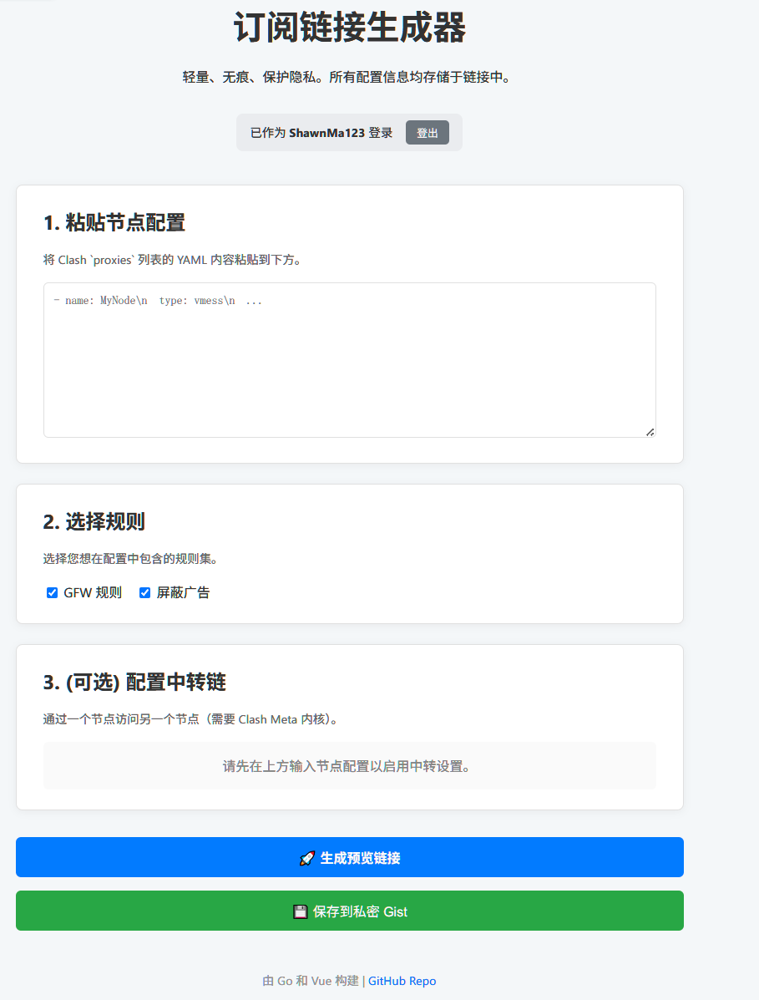

# sub-node-cvt

[中文](./README.md) | **English**

A lightweight, stateless, and privacy-focused subscription link generator for Clash/Clash-Meta. It allows users to convert node configurations (in YAML format) into powerful subscription links and supports secure, private hosting via GitHub Gists.

The core design philosophy is **statelessness and privacy-first**. When using the URL mode, all configuration is encoded in the link itself. When using the Gist mode, the configuration is securely stored in the user's own private Gist. The backend service never stores any user data.


---

## ✨ Core Features

-   **Dual Generation Modes**:
    -   **URL Mode**: Encodes all configurations into a very long URL. Simple, direct, and requires no authentication.
    -   **Gist Mode**: Through GitHub OAuth, securely saves the generated configuration to the user's own **private Gist**, providing a short and stable subscription link. Updating the configuration is as simple as editing the Gist.
-   **Privacy & Security**:
    -   The backend is completely stateless and does not log any user information or configurations.
    -   Gist creation uses the standard OAuth 2.0 flow, requesting only the minimum necessary permissions.
-   **Powerful Configuration**:
    -   Direct input support for Clash Meta `proxies` in YAML format.
    -   Configuration of relay chains (chain proxies).
    -   Pluggable rule sets (e.g., ad-blocking, GFW list).
-   **Lightweight & High-Performance**:
    -   The backend is written in Go, offering excellent performance and low resource usage.
    -   The frontend is built with Vue 3 for a responsive user experience.
-   **Multiple Deployment Options**: Supports local execution, traditional server deployment, and containerization via Docker.

## 🛠️ Tech Stack

-   **Backend**: Go (Golang)
    -   Web Framework: `net/http`
    -   GitHub Integration: `golang.org/x/oauth2`, `github.com/google/go-github`
-   **Frontend**: Vue 3 (Composition API) & `js-yaml`
-   **Deployment**: Docker, Docker Compose, systemd

## 🚀 Quick Start (Local Development)

### 1. Prerequisites

-   Go 1.23 or higher.
-   A GitHub OAuth Application for the Gist feature.
    -   Create one in your [GitHub Developer Settings](https://github.com/settings/developers).
    -   **Homepage URL**: `http://localhost:8080`
    -   **Authorization callback URL**: `http://localhost:8080/auth/github/callback`
    -   Obtain the `Client ID` and `Client Secret` after creation.

### 2. Clone the Repository

```bash
git clone https://github.com/ShawnMa123/sub-node-cvt.git
cd sub-node-cvt
```

### 3. Configure Environment Variables

To run the application locally, you need to set environment variables. The easiest way is via a single command:

```bash
# Replace "xxx" with your actual ID and Secret
GITHUB_CLIENT_ID="xxx" GITHUB_CLIENT_SECRET="xxx" go run main.go
```
The application will start at `http://localhost:8080`.

### 4. How to Use

1.  Open `http://localhost:8080` in your browser.
2.  **(Optional) Sign in with GitHub**: Click "Sign in with GitHub" to enable the Gist feature.
3.  **Paste Nodes**: Paste your Clash `proxies` list into the text area.
4.  **Select Rules & Configure Relays**.
5.  **Generate Link**:
    -   Click **"Generate Preview Link"** to get a long URL containing all information.
    -   If signed in, click **"Save to Private Gist"** to upload the configuration to your GitHub and get a short, stable Gist raw URL as the subscription link.

## Deployment Options

### Option 1: Using Docker and Docker Compose (Recommended)

This is the simplest and most portable deployment method.

1.  **Create a `.env` file**:
    Create a `.env` file in the project root and fill in your secrets:
    ```env
    GITHUB_CLIENT_ID="iv1.xxxxxxxxxxxxxxxx"
    GITHUB_CLIENT_SECRET="xxxxxxxxxxxxxxxxxxxxxxxxxxxxxxxxxxxxxxxx"
    ```
    **IMPORTANT**: Add the `.env` file to your `.gitignore`!

2.  **Start the Service**:
    With Docker and Docker Compose installed, run the following command in the project root:
    ```bash
    docker-compose up -d
    ```
    The service will be running at `http://<your_server_ip>:8080`.

### Option 2: Using `systemd` on a Linux Server

This is a stable and reliable method for traditional deployments.

1.  **Build the Application**:
    Compile a static binary for your Linux server:
    ```bash
    CGO_ENABLED=0 GOOS=linux go build -ldflags="-w -s" -o sub-node-cvt main.go
    ```

2.  **Upload Files**:
    Upload the following files and directories to the same location on your server (e.g., `/opt/sub-node-cvt/`):
    -   `sub-node-cvt` (the compiled binary)
    -   `frontend/`
    -   `templates/`
    -   `rulesets/`

3.  **Configure the `systemd` Service**:
    -   Create an environment file at `/etc/sub-node-cvt/config.env` and add your secrets.
    -   Create a `systemd` unit file at `/etc/systemd/system/sub-node-cvt.service` with the following content:
    ```ini
    [Unit]
    Description=Subscription Node Converter
    After=network.target

    [Service]
    User=your_username # Replace with your username
    WorkingDirectory=/opt/sub-node-cvt # Replace with your app directory
    EnvironmentFile=/etc/sub-node-cvt/config.env
    ExecStart=/opt/sub-node-cvt/sub-node-cvt
    Restart=always

    [Install]
    WantedBy=multi-user.target
    ```

4.  **Start the Service**:
    ```bash
    sudo systemctl daemon-reload
    sudo systemctl enable --now sub-node-cvt
    ```

## 💡 Future Plans

-   [ ] Support more node formats (e.g., V2RayN share links).
-   [ ] Allow users to update an existing Gist instead of creating a new one each time.
-   [ ] Adapt for deployment on Cloudflare Workers.
