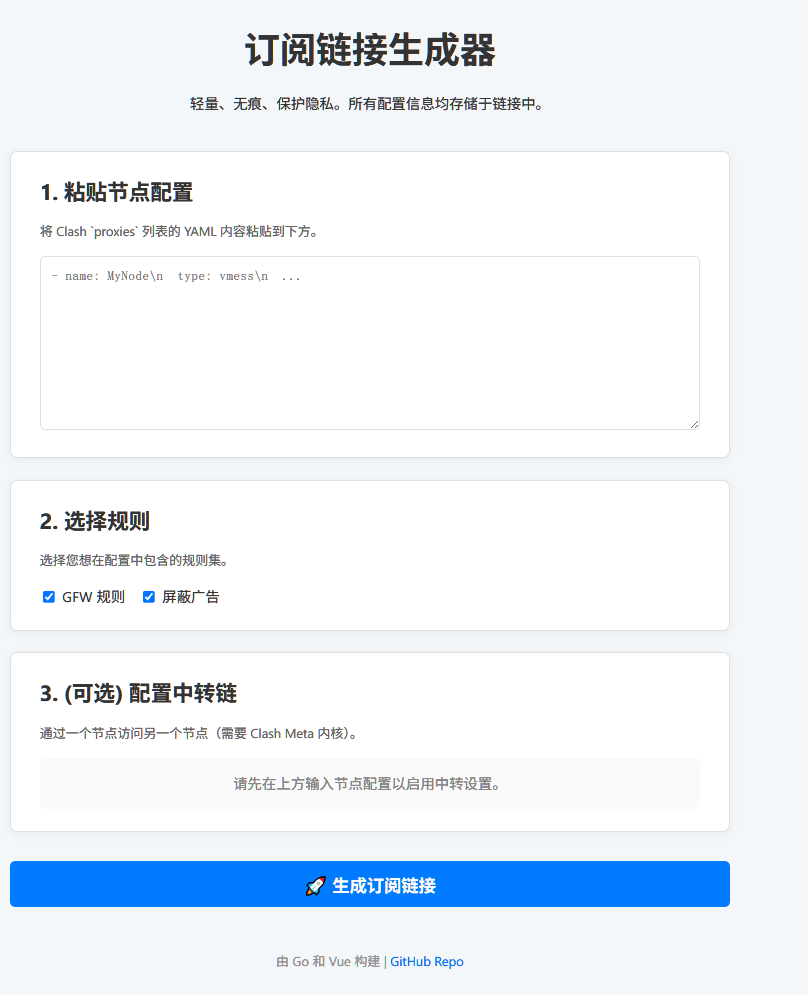

# sub-node-cvt

[中文](./README.md) | **English**

A lightweight, stateless, and privacy-focused subscription link generator for Clash/Clash-Meta. It allows users to convert node configurations (in YAML format) into powerful subscription links through a simple web interface, supporting custom rules, relay chains, and other advanced features.

Thanks to its stateless design, the backend service stores no user data. All configuration information is encoded into the generated URL, ensuring ultimate privacy and security.



---

## ✨ Core Features

-   **Stateless & Privacy-First**: The backend stores zero user data. All information is processed dynamically from the URL.
-   **Lightweight**: A high-performance backend written in Go and a minimal frontend built with vanilla Vue 3, resulting in extremely low resource consumption.
-   **Easy to Deploy**: Can be run as a single binary on a local machine/server, and is a perfect fit for serverless platforms like Cloudflare Workers.
-   **Powerful Configuration**:
    -   Direct input support for Clash Meta `proxies` in YAML format.
    -   Configuration of relay chains (chain proxies).
    -   Pluggable rule sets (e.g., ad-blocking, GFW list).
    -   Automatic generation of proxy groups, including all original nodes and relay chains.
-   **Friendly User Interface**: A clean and intuitive web UI with real-time feedback, enabling one-click generation and copying of subscription links.

## 🛠️ Tech Stack

-   **Backend**: Go (Golang)
    -   Web Framework: `net/http` (Standard Library)
    -   YAML Parsing: `gopkg.in/yaml.v3`
-   **Frontend**: Vue 3 (Composition API)
    -   UI: Custom minimalist CSS
    -   Dependencies: `js-yaml` (for parsing node names on the client-side)
-   **Database**: None! (All config templates and rule sets are stored as files within the project repository)

## 🚀 Quick Start

### 1. Prerequisites

-   Go 1.18 or higher

### 2. Clone the Repository

```bash
git clone https://github.com/ShawnMa123/sub-node-cvt.git
cd sub-node-cvt
```

### 3. Install Dependencies

Go will handle dependencies automatically on the first run, but you can also install them manually.

```bash
go mod tidy
```

### 4. Run Locally

Run the following command to start both the backend API and the frontend static file server.

```bash
go run main.go
```

Once the service is running, open your browser and navigate to `http://localhost:8080`.

### 5. How to Use

1.  **Paste Nodes**: Paste your Clash `proxies` list (in YAML format) into the first text area.
2.  **Select Rules**: Check the rules you want to include, such as "AdGuard" or "GFW".
3.  **(Optional) Configure Relay Chains**:
    -   After you input nodes, the dropdown menus for relay configuration will be enabled.
    -   Select a "Relay Node (Entry)" and a "Landing Node (Exit)".
    -   Click the "Add" button. You can add multiple relay chains.
4.  **Generate Link**: Click the "🚀 Generate Subscription Link" button.
5.  **Use the Link**:
    -   Copy the generated subscription link.
    -   Add it to Clash Meta or any other compatible client.

## Deployment

### On a Standard Server

1.  **Build the Binary**:
    For optimal performance and compatibility, build the binary for your target server.

    ```bash
    # Build for a Linux server
    CGO_ENABLED=0 GOOS=linux GOARCH=amd64 go build -o sub-node-cvt main.go
    ```

2.  **Upload Files**:
    Upload the following files and directories to your server:
    -   `sub-node-cvt` (the compiled binary)
    -   `frontend/` (the entire directory)
    -   `templates/` (the entire directory)
    -   `rulesets/` (the entire directory)

3.  **Run the Service**:
    Execute the binary on your server. It is recommended to use a process manager like `systemd` or `supervisor`.

    ```bash
    ./sub-node-cvt
    ```

    The service will run on port `8080` by default. You can use a reverse proxy like Nginx or Caddy to configure a domain name and HTTPS.

## 💡 Future Plans

-   [ ] Support for more node formats (e.g., V2RayN share links).
-   [ ] Adapt for deployment on Cloudflare Workers.
-   [ ] Allow users to provide custom rule set URLs.
-   [ ] Provide a Docker image for easy containerized deployment.
